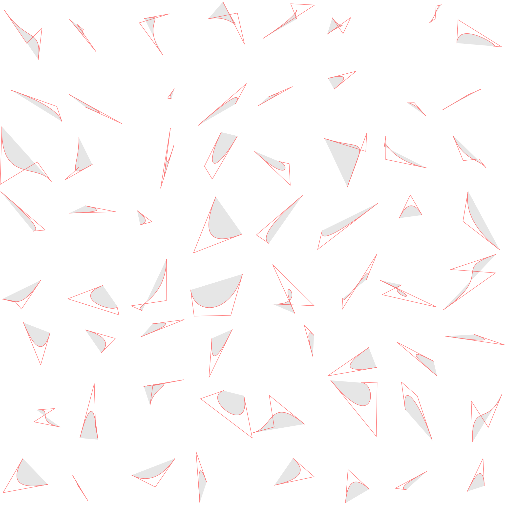

# Beziers




```go
package main

import (
	"math/rand"

	"github.com/fogleman/gg"
)

func main() {
	const (
		S = 256
		W = 8
		H = 8
	)

	dc := gg.NewContext(S*W, S*H)
	dc.SetRGB(1, 1, 1)
	dc.Clear()
	for j := 0; j < H; j++ {
		for i := 0; i < W; i++ {
			// center point
			x := float64(i)*S + S/2
			y := float64(j)*S + S/2

			dc.Push()
			dc.Translate(x, y)
			dc.Scale(S/2, S/2)
			if j%2 == 0 {
				randomCubic(dc)
			} else {
				randomQuadratic(dc)
			}
			dc.Pop()
		}
	}
	dc.SavePNG("out.png")
}

func random() float64 {
	return rand.Float64()*2 - 1
}

func point() (x, y float64) {
	return random(), random()
}

func drawCurve(dc *gg.Context) {
	dc.SetRGBA(0, 0, 0, 0.1)
	dc.FillPreserve()
	dc.SetRGB(0, 0, 0)
	dc.SetLineWidth(12)
}

func drawPoints(dc *gg.Context) {
	dc.SetRGBA(1, 0, 0, 0.5)
	dc.SetLineWidth(2)
	dc.Stroke()
}

func randomQuadratic(dc *gg.Context) {
	x0, y0 := point()
	x1, y1 := point()
	x2, y2 := point()

	//draw a curve
	dc.MoveTo(x0, y0)
	dc.QuadraticTo(x1, y1, x2, y2)
	drawCurve(dc)

	// draw control points as lines
	dc.MoveTo(x0, y0)
	dc.LineTo(x1, y1)
	dc.LineTo(x2, y2)
	drawPoints(dc)
}

func randomCubic(dc *gg.Context) {
	x0, y0 := point()
	x1, y1 := point()
	x2, y2 := point()
	x3, y3 := point()

	// draw a curve
	dc.MoveTo(x0, y0)
	dc.CubicTo(x1, y1, x2, y2, x3, y3)
	drawCurve(dc)

	// draw control points as lines
	dc.MoveTo(x0, y0)
	dc.LineTo(x1, y1)
	dc.LineTo(x2, y2)
	dc.LineTo(x3, y3)
	drawPoints(dc)
}
```