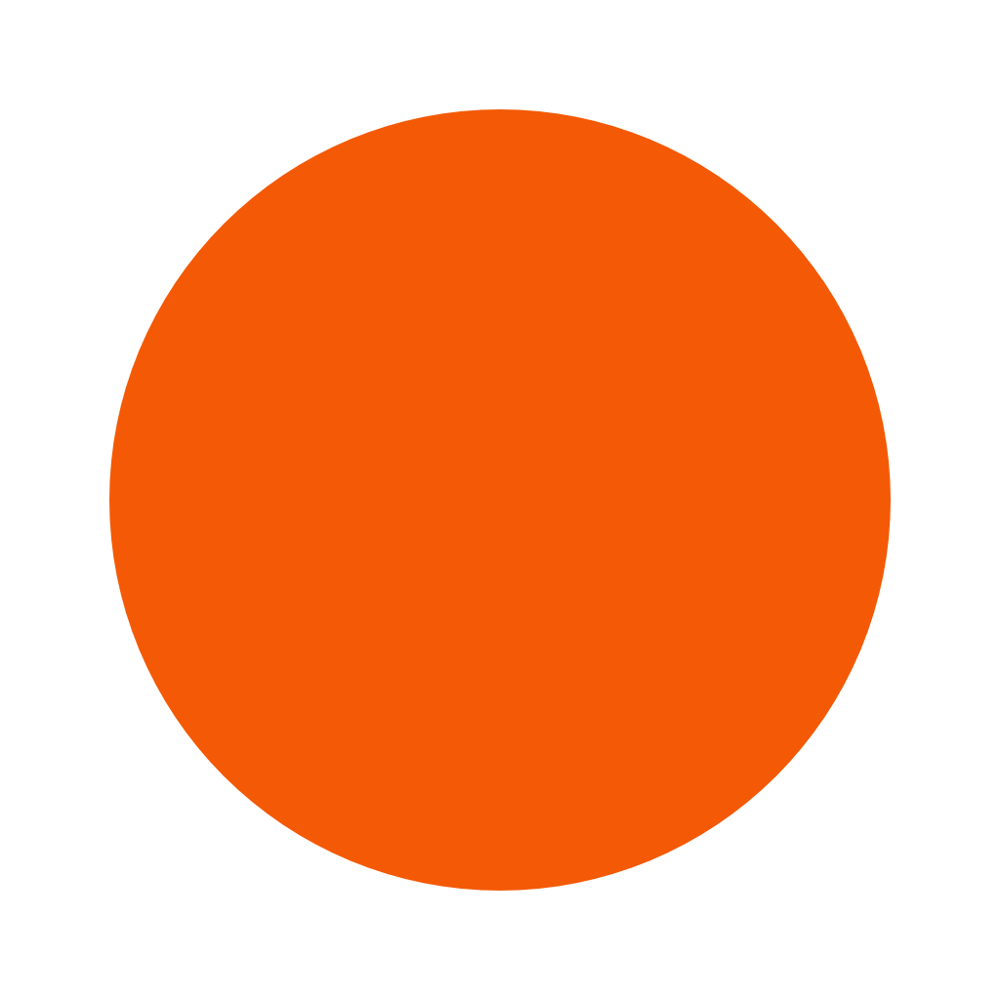

# circle




```go
package main

import (
	"github.com/fogleman/gg"
)

func main() {

	const w int = 1024
	const h int = 1024

	dc := gg.NewContext(w, h)
	dc.DrawCircle(float64(w/2), float64(h/2), 400)
	dc.SetRGBA255(0xf4, 0x59, 0x05, 0xff)
	dc.Fill()
	dc.SavePNG("out.png")
}
```
