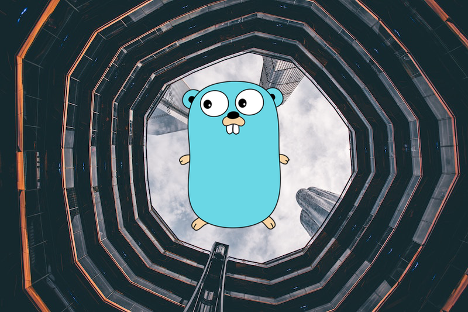

# concat



```go
package main

import (
	"math"

	"github.com/fogleman/gg"
)

func main() {
	im1, err := gg.LoadJPG("building.jpg")
	if err != nil {
		panic(err)
	}

	im2, err := gg.LoadPNG("gopher.png")
	if err != nil {
		panic(err)
	}

	s1 := im1.Bounds().Size()
	s2 := im2.Bounds().Size()

	width := int(math.Max(float64(s1.X), float64(s2.X)))
	height := int(math.Max(float64(s1.Y), float64(s2.Y)))

	dc := gg.NewContext(width, height)
	dc.DrawImage(im1, 0, 0)
	dc.DrawImage(im2, width/2-s2.X/2, height/2-s2.Y/2)
	dc.SavePNG("out.png")
}
```