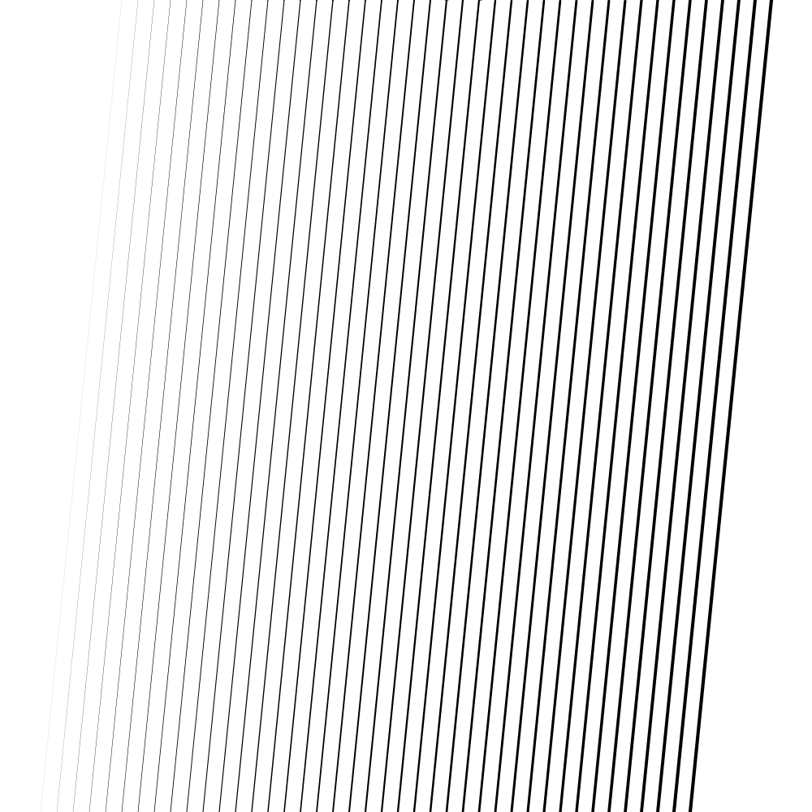

# Line Width



```go
package main

import "github.com/fogleman/gg"

func main() {
	const S = 1000

	dc := gg.NewContext(S, S)
	dc.SetRGB(1, 1, 1)
	dc.Clear()
	dc.SetRGB(0, 0, 0)
	w := 0.1
	for i := 100; i <= 900; i += 20 {
		x := float64(i)
		dc.DrawLine(x+50, 0, x-50, S)
		dc.SetLineWidth(w)
		dc.Stroke()
		w += 0.1
	}
	dc.SavePNG("out.png")
}
```